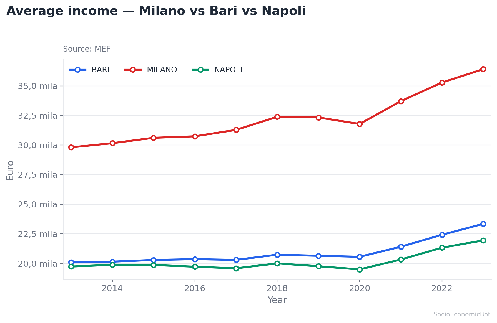
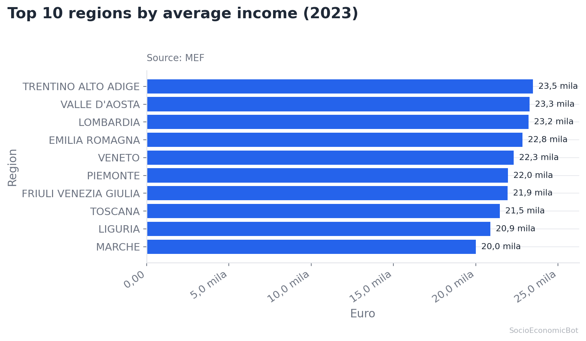
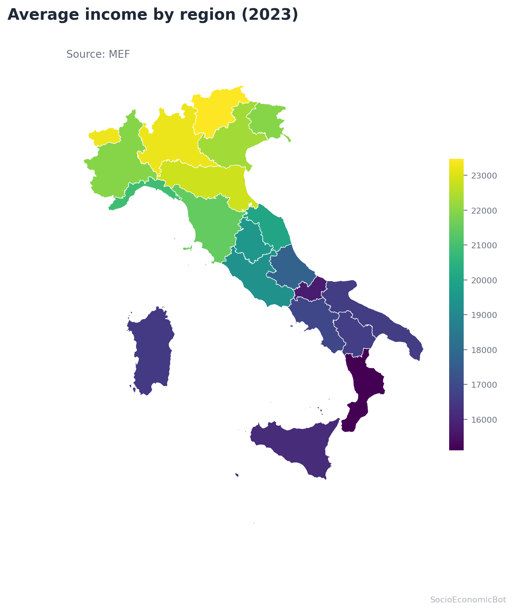

# Italian Municipal Analytics Bot

**Natural-language access to official Italian municipal statistics — a question in
plain language returns a rigorous chart or map and a written analysis in seconds.**

> _"Reddito medio Bari e Napoli nel tempo"_ · _"Classifica dei 10 comuni più ricchi"_ ·
> _"Laureati per regione"_ · _"/map reddito medio"_

Author: **Giulio Albano** — University of Bari (UNIBA), PhD in Economics and Finance of
Public Administrations.

---

## Why it matters

Official statistics on Italy's 8,000 municipalities are rich but hard to use: dozens of
technical variables, spread across ISTAT, MEF, MIUR, Infocamere and Eurostat, normally
reachable only by someone who can write code. This project removes that barrier — anyone
can ask a question in ordinary Italian or English and get a publication-quality answer.

**Methodological principle (the important part).** The language model *never produces the
numbers*. It only translates the user's question into a **structured query** over the
official dataset; every value shown is read directly from the source data and can be
traced back to it. This is the correct pattern for combining AI with official statistics:
the model decides *what to fetch and how to display it*, the data provides *the figures*.

## What it can answer

**Compare places over time** — one clean line per municipality.



**Rank municipalities, provinces or regions** — top or bottom N, by any indicator.



**Map any indicator across Italy** — regional choropleth, rendered without geopandas.



Plus: single-place time series, territorial aggregation (municipality → province → region),
and a **random mode** (`/plot`, `/map`) that showcases the range in one tap. Every answer is
accompanied by a short written commentary (headline, three insights, bottom line).

## How it works — the pipeline

```
user message
   │
   ▼  1. intent gate          classifier: data / help / info / nonsense (+ rate limiting)
   ▼  2. structured parse     LLM turns the question into parameters (places, indicator,
   │                             period, intent). The REAL variable catalog — 80+ column
   │                             names + descriptions + synonyms — is injected into the
   │                             prompt, so the model maps questions to actual variables.
   ▼  3. metric resolver      each returned term is matched to a real column
   │                             (exact → synonym → fuzzy); unknown terms are dropped, never
   │                             silently charted as empty.
   ▼  4. query & reshape      filter on 196k rows, reshape long→wide (one series per place)
   ▼  5. choose the view      chart type is decided from the DATA SHAPE, not guessed by the
   │                             model (time → line, few categories → bars, many → horizontal
   │                             bars, ranking → horizontal bars), or a regional map
   ▼  6. render               Matplotlib chart / GeoJSON choropleth
   ▼  7. commentary           LLM writes a short, grounded analysis (numbers only)
   ▼
 reply (image + text)
```

## Data

A single local table, **~196,000 rows × ~80 variables**, covering Italian municipalities
over time, assembled and normalised from official sources:

| Domain | Examples | Source |
|---|---|---|
| Income & tax | average income, taxable income, pensions, taxpayers | MEF |
| Population & migration | resident population, migration balance | ISTAT |
| Education | graduates (total / women / men) | MIUR |
| Inequality | Gini index | derived |
| Firms & innovation | active / registered firms, patents | Infocamere |
| Territory | region, province, NUTS3, capoluogo flag | ISTAT / Eurostat |

A machine-readable **variable dictionary** (`resources/dizionario_variabili.csv`: name,
source, description, synonyms) documents every field and powers the LLM's column mapping.
Derived indicators (`reddito_medio`, `laureati_pct`, …) are computed at load time.

## Engineering highlights

- **Catalog-driven prompting.** The model is given the real schema (80+ columns + synonyms)
  instead of a handful of hardcoded terms — turning "a few answerable questions" into "almost
  any variable in the dataset", in two languages.
- **Deterministic view selection.** The chart is chosen from the shape of the data, so the
  output is predictable and correct regardless of model phrasing.
- **Maps without heavy dependencies.** The regional choropleth is drawn from a GeoJSON with
  plain `json` + matplotlib (no geopandas), joined to the data by robust name-normalization
  (accents, hyphens and bilingual ISTAT region names all handled).
- **Performance.** The dataset is read once; queries filter the frame directly (no per-request
  copy) with a precomputed key, and LLM parses are cached — sub-100 ms per query on 196k rows.
- **Correctness & robustness.** Long→wide reshaping prevents phantom series; unknown metrics
  are dropped rather than mischarted; commentary is Telegram-safe with a plain-text fallback;
  per-user rate limiting and a nonsense filter protect the service.

## Architecture

```
main.py                      Telegram app: commands, menus, random mode, orchestration
modules/
  llm_processor.py           NL request → structured parameters; LLM commentary
  catalog.py                 variable dictionary → prompt block + synonym resolver
  data_query.py              filtering, long→wide reshaping, ranking, chart-type choice
  chart_generator.py         Matplotlib charts (line / bar / barh / pie)
  map_generator.py           regional choropleth from GeoJSON (no geopandas)
  classifier.py              lightweight intent gate
resources/
  df_ridotto_bot.csv         municipal dataset (local, git-ignored)
  dizionario_variabili.csv   variable dictionary
  geo/regioni.geojson        Italian regions boundaries (local, git-ignored)
```

## Setup

Requires Python 3.10+.

```bash
python -m venv .venv
# Windows:  .venv\Scripts\activate  ·  macOS/Linux:  source .venv/bin/activate
pip install -r requirements.txt
```

Configuration via `.env` in the project root:

| Variable | Required | Purpose |
|---|---|---|
| `TELEGRAM_BOT_TOKEN` | ✅ | BotFather token |
| `OPENAI_API_KEY` | optional | OpenAI (`sk-…`) — enables LLM parsing & commentary |
| `IT_REGIONI_GEOJSON` | optional | Regions GeoJSON path (default `resources/geo/regioni.geojson`) |

The real `.env`, the dataset and the GeoJSON are git-ignored — never commit tokens or data.

## Run

```bash
python main.py
```

Only one polling instance may run at a time.

## Usage

```
Reddito medio Bari e Napoli nel tempo      # comparison → two lines
Classifica dei 10 comuni più ricchi        # ranking
Laureati per regione                       # aggregation
/map reddito medio                         # regional choropleth
/plot   ·   /map                           # random chart / map
```

## Limits & notes

- Maps are at **regional** level (a regions GeoJSON is bundled locally); province-level maps
  would need a provinces GeoJSON.
- LLM usage (OpenAI/Gemini) incurs cost; validate and monitor your key.
- Data availability follows the underlying official sources.

## Attribution

Data: ISTAT, MEF, MIUR, Infocamere, Eurostat. Region boundaries:
[openpolis / geojson-italy](https://github.com/openpolis/geojson-italy). Built with
`python-telegram-bot`, pandas and matplotlib.
